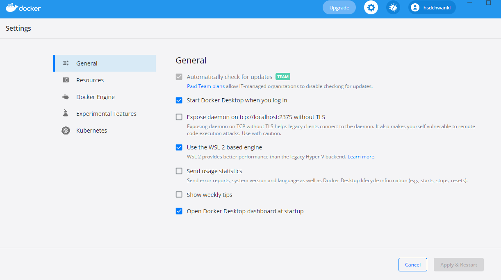
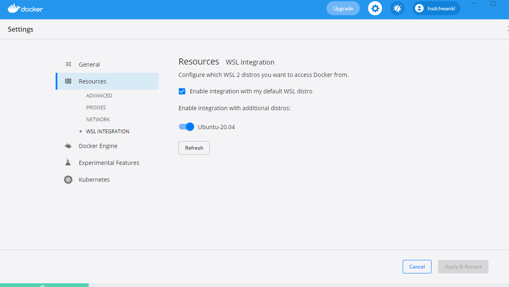
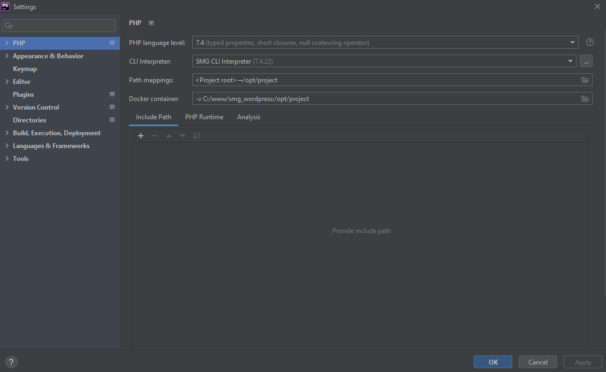
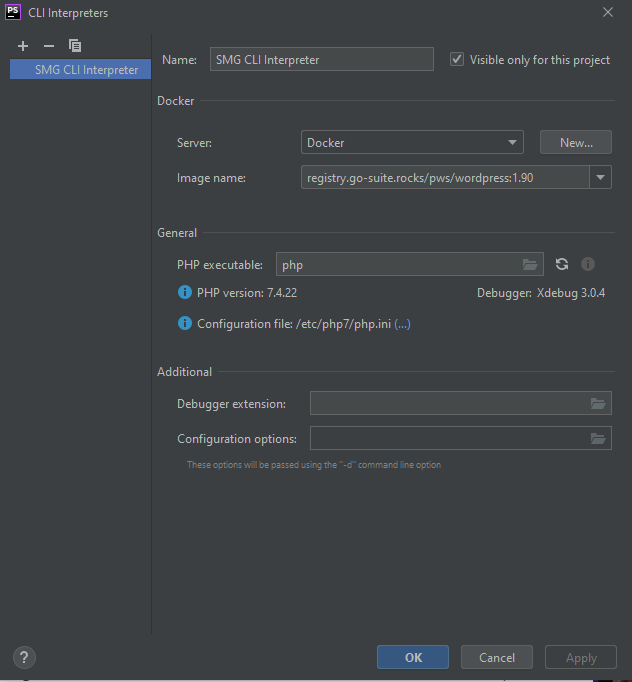
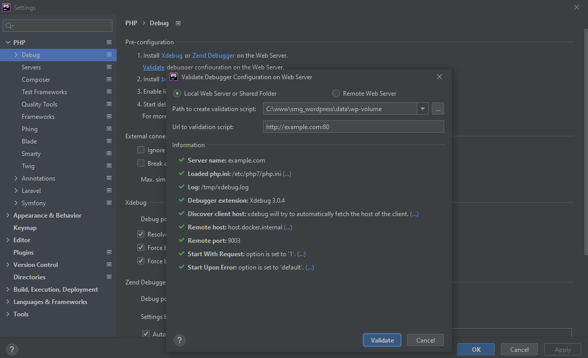
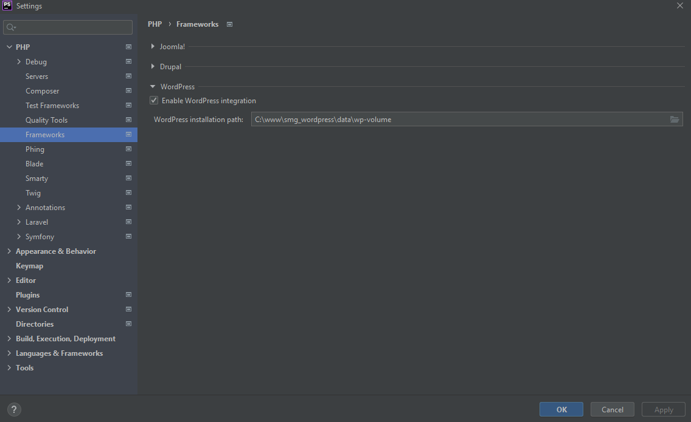
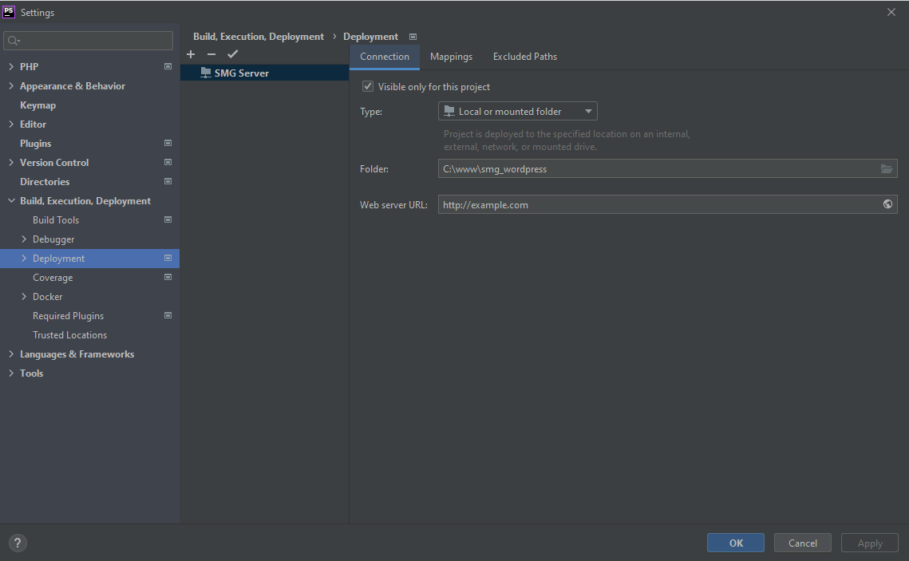
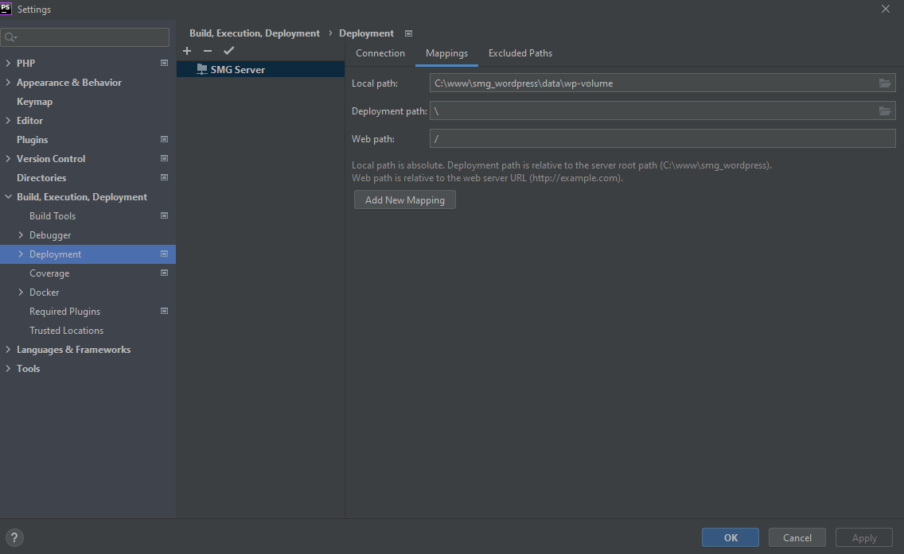

## Documentation

This Docker configuration is for Development only.

Integrated functionality:

* For speed up local development environment NGINX caching and gzip compression
  Todo: ERROR: SSL Failed to load resource: net::ERR_HTTP2_PROTOCOL_ERROR
* Changed to MariaDB Database for Speed improvement
* Improved volumes directive in docker-compose.yml for speed optimization   
* Enabled XDebug (https://xdebug.org/docs/)
* XDebug with PHPStorm (https://www.jetbrains.com/help/phpstorm/debugging-with-phpstorm-ultimate-guide.html)  
* Enabled Debug on WordPress
* Added "mailhog" for Email testing https://akrabat.com/using-mailhog-via-docker-for-testing-email/
* Added "phpmyadmin" for Database development
* Added Documentation for Development Environment (https://www.markdownguide.org/)

TODO: Deploy a Layout in the local WordPress Configuration

### 1 Dependencies

#### 1.1 Installation Docker Desktop Windows 10

#### 1.1.1 Requirements and Installation

Your Windows computer must meet the following requirements to install successful docker desktop.

- Windows 10 64-Bit: Home, Pro, Enterprise or Education, Version 1903 (Build 18362 or higher).
- Activate the WSL 2-Functionality on Windows.
- The following hardware required to run WSL 2 on Windows 10: For detailed instructions see the Microsoft documentation: https://docs.microsoft.com/en-us/windows/wsl/install-win10.
    * 64-Bit-Processor mit Second Level Address Translation (SLAT) https://en.wikipedia.org/wiki/Second_Level_Address_Translation.
    * 4GB System RAM
    * Support for BIOS-level hardware virtualization must be enabled in the BIOS settings. For more information see Virtualization: https://docs.docker.com/docker-for-windows/troubleshoot/#virtualization-must-be-enabled.
    * Download and install the Linux kernel update package: https://docs.microsoft.com/de-de/windows/wsl/install-win10#step-4---download-the-linux-kernel-update-package.

The complete installation instructions can be found at: https://docs.docker.com/docker-for-windows/install/.

#### 1.1.2 Download and install Ubuntu 20.04 on Windows 10

Complete installation instructions can be found at: https://konsumschaf.de/post/ubuntu-mit-dem-windows-subsystem-for-linux-wsl-auf-windows-10-installieren/

#### 1.1.3 Activate Ubuntu on Docker Desktop

### General Settings



### Resources -> NETWORK Settings

* Click on Settings in Docker Desktop
* Click on Resources
* Click on WSL Integration
* Enable integration with my default WSL distro
* Activate Ubuntu-20.04



### 2. Installation PHP Development Environment

With the terminal command given below the applications are generated
and then started the service. You must be in the directory of the project root
where the docker-compose.yml file is located.
```
docker-compose up
docker-compose up -d
```

If an error has occurred and has made adjustments to the setup, you must execute the following command.
```
docker-compose up --build
```

To stop the service, you enter
```
docker-compose down
```

For additional Information look at: https://phoenixnap.com/kb/remove-docker-images-containers-networks-volumes

### 3 Configure PHPStorm

#### 3.1 PHP Settings "File-Settings-PHP"

### PHP Settings

* Set "PHP language level" to 7.4



### CLI Interpreter

* Select "CLI Interpreter"
* Set Name to "SMG CLI Interpreter"
* Select "Server" to Docker
* Select "Image name" to registry.go-suite.rocks/pws/wordpress:1.90
* Debugger: Xdebug 30.0.4 must shown



#### 3.2 Debug Settings "File-Settings-PHP-Debug"

* Click on "Validate" debugger configuration on the Web Server. No error must have shown.



"Cancel" and "Apply" 

#### 3.3 Frameworks Settings "File-Settings-PHP-Framework"

* WordPress
* Enable WordPress integration
* 'WordPress' installation path: to "wp-volume"



#### 3.4 Deployment Settings "File-Settings-Build, Execution, Deployment-Deployment"

* Select Type "Local or mounted folder"
* Folder -> The folder where docker-compose.yml lays
* Web server URL: "http://example.com"



* Change to Mappings
* Change "Local path" to "wp-volume"
* Select Deployment path
* Change "Web path" to "/"



## 4. Development

#### 4.1 Configure Ubuntu

#### 4.1.1 Install "node.js" on Ubuntu

a) Install "cURL" (a tool for downloading content from the Internet from the command line) with
```
sudo apt-get install curl.
```
b) Install "nvm" with
```
curl -o- https://raw.githubusercontent.com/nvm-sh/nvm/v0.36.0/install.sh | bash
```
Find the newest version of "nvm" on: https://github.com/nvm-sh/nvm
c) To verify the installation, type command 
```
-v nvm
```
d) nstall the current release of Node.js (to test the latest feature improvements, but which probably contains some bugs): 
```
nvm install node
```
e) Install the latest stable LTS release of Node.js (recommended): 
```
nvm install --lts
```
f) List the installed versions of Node on: 
```
nvm ls 
```
g) Use 
```
node --version 
```
to check if Node.js is installed and has the latest version. Then check if you also have npm: 
```
npm --version 
```
(You can also use which node or which npm to display the path used for the default versions.)
Now you should list the two versions you just installed.
h) To change the version of Node.js that you want to use for a project, create a new project directory 
```
mkdir NodeTest
```
and switch to the directory (cd NodeTest).
Then type 
```
nvm use node 
```
and switch to the current version, or use 
```
nvm use --lts 
```
to switch to the LTS version. You can also use a specific other version that you have installed, e.B. 
```
nvm use v8.2.1 
```
To list all available versions of Node.js, use the
```
nvm ls-remote 
```
command.

**Change node version example for "DIVI" development**
```
node -v
install nvm
nvm use 14.17.4
```

For additional Information look at: https://docs.microsoft.com/de-de/windows/dev-environment/javascript/nodejs-on-wsl

#### 4.1.2 Install "yarn" on Ubuntu

Used for "DIVI" development. 
```
sudo apt update
sudo apt install yarn
```
For additional Information look at: https://linuxize.com/post/how-to-install-yarn-on-ubuntu-20-04/

#### 4.1.3 Install "SASS" on Ubuntu (https://sass-lang.com/)

You can install SASS in Ubuntu with two simple commands:
```
sudo apt-get install ruby-full build-essential rubygems
sudo gem install sass
```
#### 4.1.4 Install "COMPOSER" on Ubuntu (https://getcomposer.org/)
You can install SASS in Ubuntu with two simple commands:
```
sudo apt update
sudo apt install php php-cli php-fpm php-json php-pdo php-mysql php-zip php-gd  php-mbstring php-curl php-xml php-pear php-bcmath
```
Now, We are downloading and installing the Composer with the following commands:
```
cd ~
curl -sS https://getcomposer.org/installer -o composer-setup.php
```
You need to execute the following PHP code to verify that the Composer installer.
```
HASH=`curl -sS https://composer.github.io/installer.sig`
```
If you want to verify the obtained value, you can run:
```
echo $HASH
```
```
Output
e0012edf3e80b6978849f5eff0d4b4e4c79ff1609dd1e613307e16318854d24ae64f26d17af3ef0bf7cfb710ca74755a
```
Now execute the following PHP code, as provided in the Composer download page, to verify that the installation script is safe to run:
```
php -r "if (hash_file('SHA384', '/tmp/composer-setup.php') === '$HASH') { echo 'Installer verified'; } else { echo 'Installer corrupt'; unlink('composer-setup.php'); } echo PHP_EOL;"
```
Run the following command to test your installation:
```
composer 
```
```
Output
   ______
  / ____/___  ____ ___  ____  ____  ________  _____
 / /   / __ \/ __ `__ \/ __ \/ __ \/ ___/ _ \/ ___/
/ /___/ /_/ / / / / / / /_/ / /_/ (__  )  __/ /
\____/\____/_/ /_/ /_/ .___/\____/____/\___/_/
                    /_/
Composer version Composer version 2.2.9 2022-03-15 22:13:37
Usage:
  command [options] [arguments]

Options:
  -h, --help                     Display this help message
  -q, --quiet                    Do not output any message
  -V, --version                  Display this application version
      --ansi                     Force ANSI output
      --no-ansi                  Disable ANSI output
  -n, --no-interaction           Do not ask any interactive question
      --profile                  Display timing and memory usage information
      --no-plugins               Whether to disable plugins.
  -d, --working-dir=WORKING-DIR  If specified, use the given directory as working directory.
      --no-cache                 Prevent use of the cache
  -v|vv|vvv, --verbose           Increase the verbosity of messages: 1 for normal output, 2 for more verbose output and 3 for debug
...
```
#### 4.1.5 Install "git" on Ubuntu (https://git-scm.com/)
First, use the apt package management tools to update your local package index.
```
sudo apt update
```
With the update complete, you can install Git:
```
sudo apt install git
```
You can confirm that you have installed Git correctly by running the following command and checking that you receive relevant output.
```
git --version
```
#### 4.1.6 Install "gettext" on Ubuntu (https://docs.python.org/3/library/gettext.html)

You can install gettext in Ubuntu with two simple commands:
```
sudo apt-get update -y
sudo apt-get install -y gettext
```
#### 4.1.7 Install "node.js" on Ubuntu (https://nodejs.org/de/)

Install Node.js and npm from the Ubuntu repository
```
sudo apt update
sudo apt install nodejs npm
```
The command above will install a number of packages, including the tools necessary to compile and install native addons from npm.
Once done, verify the installation by running:
```
sudo apt update
sudo apt install nodejs npm

nodejs --version
```
#### 4.1.6 Install "WP CLI" on Ubuntu (https://wp-cli.org/)

Before installing WP-CLI, please make sure your environment meets the minimum requirements:

UNIX-like environment (OS X, Linux, FreeBSD, Cygwin); limited support in Windows environment
PHP 5.6 or later
WordPress 3.7 or later. Versions older than the latest WordPress release may have degraded functionality

Once you’ve verified requirements, download the wp-cli.phar file using wget or curl:
```
curl -O https://raw.githubusercontent.com/wp-cli/builds/gh-pages/phar/wp-cli.phar
```
Next, check the Phar file to verify that it’s working:
```
php wp-cli.phar --info
```
To use WP-CLI from the command line by typing wp, make the file executable and move it to somewhere in your PATH. For example:
```
chmod +x wp-cli.phar
sudo mv wp-cli.phar /usr/local/bin/wp
```
If WP-CLI was installed successfully, you should see something like this when you run wp --info:
```
$ wp --info
OS:     Linux 5.10.60.1-microsoft-standard-WSL2 #1 SMP Wed Aug 25 23:20:18 UTC 2021 x86_64
Shell:  /usr/bin/zsh
PHP binary:     /usr/bin/php8.1
PHP version:    8.1.0
php.ini used:   /etc/php/8.1/cli/php.ini
MySQL binary:   /usr/bin/mysql
MySQL version:  mysql  Ver 8.0.27-0ubuntu0.20.04.1 for Linux on x86_64 ((Ubuntu))
SQL modes:
WP-CLI root dir:        /home/wp-cli/
WP-CLI vendor dir:      /home/wp-cli/vendor
WP_CLI phar path:
WP-CLI packages dir:    /home/wp-cli/.wp-cli/packages/
WP-CLI global config:
WP-CLI project config:  /home/wp-cli/wp-cli.yml
WP-CLI version: 2.6.0
```
Updating
```
wp cli update
```
#### 4.2 Configure "DIVI" Development

Chang to "plugins" folder : smg-theme-extension

#### 4.2.1 Install Dependencies
```
yarn install
```
#### 4.2.1 "DIVI" Extension Development Documentation

For additional Information look at:

- https://www.elegantthemes.com/documentation/developers/divi-development-environment/
- https://www.elegantthemes.com/documentation/developers/create-divi-extension/
- https://github.com/elegantthemes/create-divi-extension
- https://github.com/elegantthemes/divi-extension-example  
- https://diviextended.com/how-to-create-custom-divi-module-part-3-understanding-yarn-commands/
- https://www.elegantthemes.com/documentation/developers/how-to-create-a-custom-field-for-a-divi-builder-module/
- https://divi.space/tips-tricks/how-to-use-divis-hooks/
- https://divi.space/blog/adding-custom-modules-to-divi/

#### 4.2.3 "React" Documentation

A comparison between JSX for React (JS) to Twig
- https://github.com/alexander-schranz/twig-for-react-devs
React Documentation
- https://reactjs.org/  

#### 4.2.4 Twig Documentation 

- https://twig.symfony.com/

#### 4.2.5 SASS Compiling
 Updating CSS files:

a) Changes in the directory ./scss
b) compile changes
```
sass scss:public/css/ --watch
```
c) deployment
```
sass scss:public/css/ --watch
```
- https://twig.symfony.com/
```  
rsync -aHv public/css/* root@cache1.sr-ver.de:/srv/www/cdn.sr-vice.de/quadra/wordpress/css/
```
d) theme testing for example on "99993.quadra-testen.de mit ?scheme=lightblue" 

## 5. GIT

For additional Information look at: https://docs.gitlab.com/ee/topics/git/

Generate SSH key: https://gitlab.go-suite.rocks/help/ssh/README#generate-an-ssh-key-pair

## 6. Redis (https://redis.io/)

Start Server
```  
redis-server
redis-cli ping
```  
Shows the IP Addresses of the running containers
```
docker ps -q | xargs -n 1 docker inspect --format '{{range .NetworkSettings.Networks}}{{.IPAddress}}{{end}} {{ .Name }}' | sed 's/ \// /'
```  

Useful Link: https://supporthost.in/install-redis-on-a-plesk-server/

## 7. Executing WP CLI in Container (https://wp-cli.org/de/)
Example: Activate Theme
```  
docker exec sasom-wordpress  wp-cli theme activate eightshift-template
```  
## 8. Conclusion

Happy coding :-)